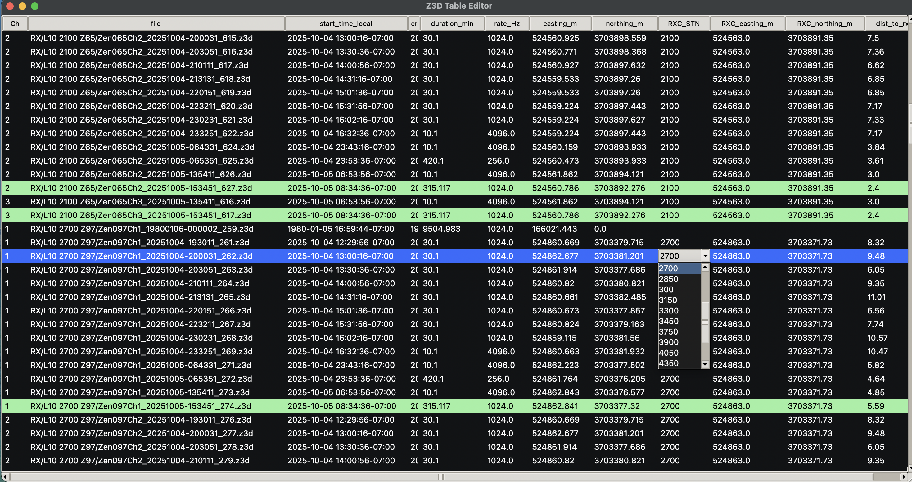

# Z3D Table Editor

A lightweight desktop tool to **inspect, edit, and batch‑update Zonge Z3D receiver files**.  
It parses GPS timing, computes local start/end times, exposes **UTM** fields for inline editing, and can **apply RXC waypoint coordinates** back into Z3D headers (writing `Lat`/`Lon` as **radians**, preserving field width). It also highlights RX files that **overlap** TX acquisition windows and exports the working table to CSV.



> Built with Python (Tkinter) and NumPy. Works on macOS/Windows/Linux; can be packaged with PyInstaller.

---

## Features at a glance

- **Table view** of .z3d files (recursive folder load)
- Columns: `Ch`, `file`, `start_time_local`, `end_time_local`, `duration_min`, `rate_Hz`, `easting_m`, `northing_m`, `RXC_STN`, `RXC_easting_m`, `RXC_northing_m`, `dist_to_rxc_m`
- **Timezone-aware** local time columns (`--tz Europe/Paris` or offset like `--tz +02:00`)
- **Inline edit** UTM Easting/Northing (double‑click) and **apply to headers** (writes Lat/Lon in **radians** if values look like radians in the file)
- **RXC (ZenPlan Waypoints.rxc)** parsing with nearest‑station match and **dropdown** per row
- **Apply RXC → Z3D**: copy selected RXC coords into the row and write back to the Z3D header
- **Highlight RX that overlap TX** windows from a selected TX folder (rows turn green/black)
- **CSV export** of the current table
- **Keyboard shortcuts** with proper menu accelerators (macOS/Windows/Linux)

---

## Installation

### Python

- Python **3.9+** (3.10 recommended). Tkinter must be available (bundled with python.org installers; on Linux install `python3-tk`).  
- Dependencies: **NumPy** only.

```bash
pip install numpy
```

### Quick run

```bash
python z3dtable.py --tz Europe/Paris /path/to/RX_folder
# or pass multiple files/folders (directories are scanned recursively)
python z3dtable.py --tz +02:00 RX1 RX2/2025-09-30 *.z3d
```

> The app opens a GUI window. If you prefer building a double‑clickable app on macOS or Windows, see **Packaging** below.

---

## Usage

### 1) Load RX files
- Start the app with one or more `.z3d` files or directories (recursive).
- The table shows one row per file with timing, rate, and georeferencing columns.

### 2) (Optional) Load a TX folder and highlight overlaps
- **Menu → File → Load TX folder** (`⇧⌘T` / `Ctrl+Shift+T`), then choose a folder of TX `.z3d` files.  
- RX rows whose start/end overlap **any** TX window are tagged and highlighted.

### 3) (Optional) Load RXC waypoints and auto‑match
- **Menu → File → Load RXC (Waypoints.rxc)** (`⇧⌘X` / `Ctrl+Shift+X`).  
- The parser tolerates RXC preambles and header variants and looks for a header containing `Rx.Stn`.  
- If `$Survey.UTMZone=…` exists, it’s used as a **zone hint**.
- The nearest RXC station is assigned per row; you can change it via the **`RXC_STN` dropdown** in the table.

### 4) Edit UTM and write back to headers
- Double‑click `easting_m` or `northing_m` to edit.
- **Apply to headers**: select rows and press **`⌘⏎` / `Ctrl+Enter`** or **Menu → Edit → Apply Changes**.  
  - The app converts UTM → Lat/Lon (deg), then writes `Lat`/`Lon` **numeric strings** into the Z3D **header region** (first 2 MB) in‑place:
    - If the existing header value looked like **radians** (|value| ≤ ~3.2), it writes **radians**; otherwise **degrees**.
    - It preserves original field width and notation (scientific vs fixed) by padding/truncating the numeric string.

### 5) Apply RXC → Z3D (one‑click workflow)
- Select rows and hit **`⇧⌘A` / `Ctrl+Shift+A`** → copies the chosen `RXC_easting_m`/`RXC_northing_m` into the row’s UTM fields and **writes headers** immediately.

### 6) Export
- **Menu → File → Export CSV…** (`⌘E` / `Ctrl+E`) exports the current table (including RXC selection and distances).

---

## Keyboard Shortcuts

| Action | macOS | Windows/Linux |
|---|---|---|
| Add RX folder | ⇧⌘R | Ctrl+Shift+R |
| Load TX folder | ⇧⌘T | Ctrl+Shift+T |
| Load RXC (Waypoints.rxc) | ⇧⌘X | Ctrl+Shift+X |
| Open selected in default app | ⌘O | Ctrl+O |
| Export CSV | ⌘E | Ctrl+E |
| Quit | ⌘Q | Ctrl+Q |
| **Apply Changes** (write UTM→header) | ⌘⏎ | Ctrl+Enter |
| Delete selected files | ⌘⌫ | Delete |
| Delete all except highlighted | ⌥⌘⌫ | Ctrl+Alt+Del |
| Refresh table | ⌘R | Ctrl+R |
| Clear highlights | ⌘K | Ctrl+K |
| Set match threshold (m) | ⇧⌘M | Ctrl+Shift+M |
| Re‑match RXC | ⇧⌘G | Ctrl+Shift+G |
| Fit columns to window | ⇧⌘F | Ctrl+Shift+F |

---

## Columns

- **Ch** – Channel number inferred from filename (`Ch1`, `Ch2`, …) or `0` if unknown.  
- **file** – Full path to the `.z3d` file.  
- **start_time_local / end_time_local** – Converted from GPS week + seconds‑of‑week using `GPS_EPOCH` (1980‑01‑06) and `GPS_UTC_LEAP_SECONDS` (set to 18). Timezone via `--tz`.  
- **duration_min** – Duration from first/last embedded GPS time words.  
- **rate_Hz** – From the header `Rate=` line (if present).  
- **easting_m / northing_m** – Editable UTM coordinates (zone/hemisphere are tracked internally per row).  
- **RXC_STN / RXC_easting_m / RXC_northing_m** – Station ID and coordinates parsed from `Waypoints.rxc`.  
- **dist_to_rxc_m** – Straight‑line distance from the row’s UTM to the chosen RXC waypoint.

---

## RXC file format tolerance

- Looks for a header containing `Rx.Stn` (case‑insensitive) and parses CSV lines **below** it.
- Ignores lines starting with `//` or `$` (preamble/directives), except it reads `$Survey.UTMZone=` as a **zone hint**.
- Field names are matched case‑insensitively; typical columns include: `Rx.Stn`, `East`, `North`, `Zone`, `Hem`.
- If zone/hem are missing, the zone hint + heuristics are used.

---

## Header write‑back (Lat/Lon)

- The app scans the first **2 MB** of each Z3D file for ASCII patterns like `Lat=...`/`Latitude=...` and `Lon=...`/`Long=...`/`Longitude=...`.
- It **replaces the numeric substring** in‑place, preserving the original field width and notation (scientific `E` vs fixed).  
- **Radians vs degrees**: if the existing header values look like radians (|lat|,|lon| ≤ ~3.2), it writes radians; else degrees.
- This is **safe** for typical headers but always **keep a backup** before batch updates.

---

## CLI

```text
usage: z3dtable.py [-h] [--tz TZ] files [files ...]

Z3D CSV-like editor with UTM, TX highlighting, RXC matching, RXC_STN dropdown, RXC→Z3D apply, and keyboard shortcuts

positional arguments:
  files         .z3d files or directories (recursive)

options:
  -h, --help    show help and exit
  --tz TZ       timezone for local time columns (IANA like 'Europe/Paris' or an offset like '+02:00')
```

Examples:
```bash
# Open a single RX folder and view in Europe/Paris time
python z3dtable.py --tz Europe/Paris /data/Survey/Line09/RX

# Open multiple items (folder + file)
python z3dtable.py --tz +00:00 ./RX1 ./RX2/CH1_20250930-183131.z3d

# Highlight RX overlapping a TX folder and export to CSV
# (in the GUI: File → Load TX folder → Export CSV)
```

---

## Packaging (optional)

You can bundle a double‑clickable app with PyInstaller:

```bash
pip install pyinstaller
pyinstaller --windowed --name "Z3D Table Editor" z3dtable.py
```

If you want a **file‑picker on double‑click** (when no args are passed), add a small `app_launcher.py` that opens a dialog and forwards selected files to `z3dtable.py`, then use a `.spec` with `argv_emulation=True` on macOS. (Ask if you’d like the ready‑made launcher/spec.)

---

## Troubleshooting

- **No Tk on Linux**: install `python3-tk` (Ubuntu/Debian) or `tk` packages.  
- **Times look off by ~18s**: update `GPS_UTC_LEAP_SECONDS` if leap seconds changed.  
- **Lat/Lon not updated**: some files store header fields beyond 2 MB; increase `HEADER_SCAN_BYTES`.  
- **Icon / packaging errors**: use a real `.icns` on macOS or set `icon=None` in the spec; install `Pillow` for auto‑conversion.

---

## License

Proprietary / internal tool (adjust as needed).
